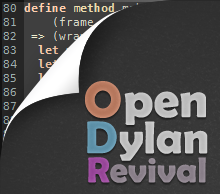

Our IndieGoGo Campaign
######################

:author: Bruce Mitchener, Jr.
:date: 2013-01-24
:tags: IndieGoGo
:status: draft

Today, we're kicking off an `IndieGoGo campaign <http://www.indiegogo.com/opendylan-revival/>`_.

While we're already using OpenDylan, we'd like to be able to dedicate
some time to improving the new user experience, the packaging of the
documentation, and fixing bugs.

This work will be above and beyond what we're already doing to make
Dylan easier to use in a production / commercial setting by creating
new libraries.

The last year has been a great year for Dylan as can be seen in the
massive improvements that have been delivered in the 2011.1 and 2012.1
releases of OpenDylan. Having the funding to dedicate more time will
be a big step towards 2013 being the best year yet for the OpenDylan
language and community.

Please `contribute <http://www.indiegogo.com/opendylan-revival/>`_!
